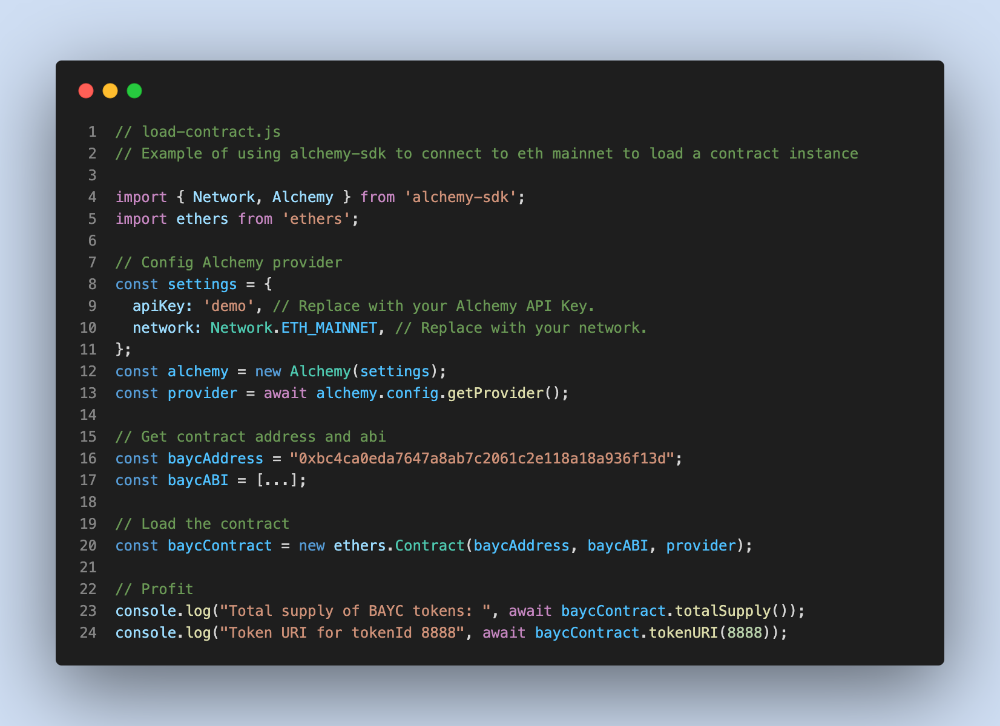

# Load Contract

How to use the Alchemy SDK to load a contract instance and access contract functions.

## Quickstart

1. `npm install`
2. Swap out the `apiKey` with your own Alchemy API key.
3. `node load-contract.js`
4. Tweak the code in `load-contract.js` for your usage.

